## 大数据实验小组报告

#### 分工表

高野淇：搭建环境，配置部署数据库 权重100%

刘志一：数据预处理，制定分析方案 权重100%

王子涵：数据分析，可视化 权重100%

### 实验题目：

大数据与云计算数据综合分析

### 实验目标：

选用life_expactancy作为数据集，配置数据仓库和相应的配置环境，将对数据进行分析和存储，并对数据进行可视化展示。


### 实验过程：

### 一： 环境部署

##### (1)Hadoop配置
###### Hadoop文件夹
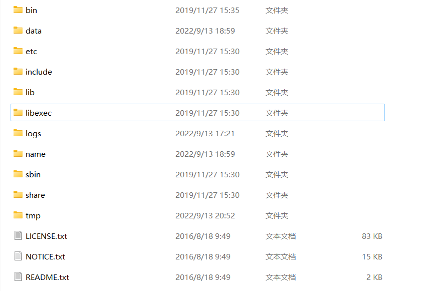
###### Hadoop配置文件说明
core-site.xml

mappered-site.xml
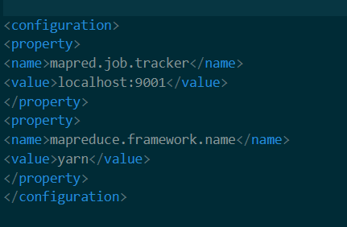
yarn-site.xml
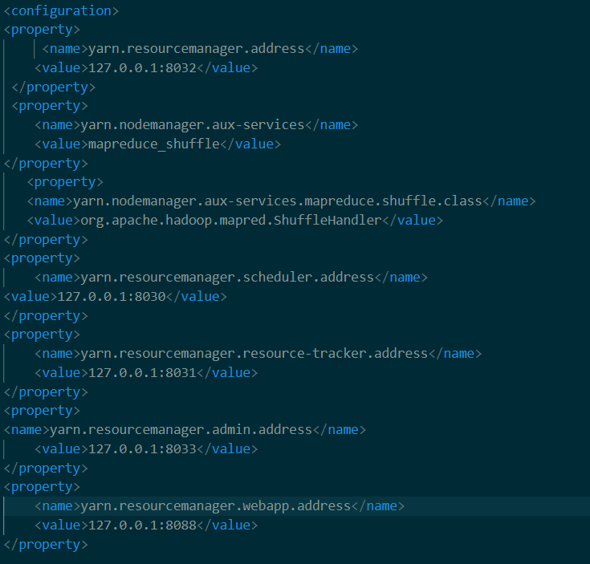

###### 环境变量配置
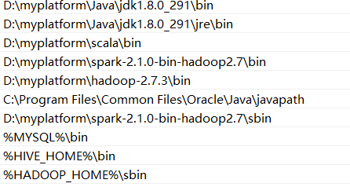
###### Hadoop启动运行效果
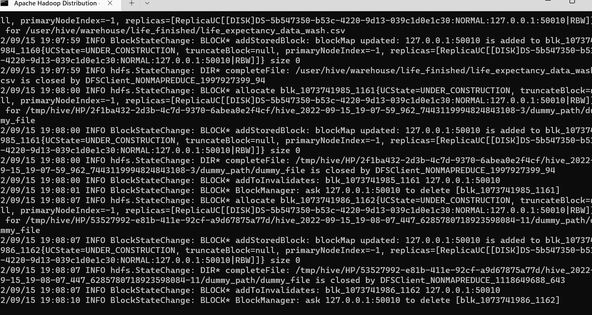
##### (2)Mysql配置
###### Mysql启动运行效果
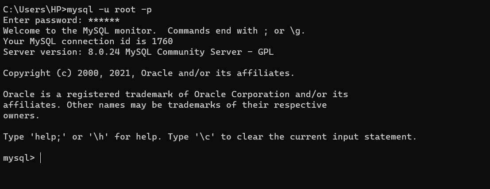
##### (3)Hive配置
###### Hive文件夹
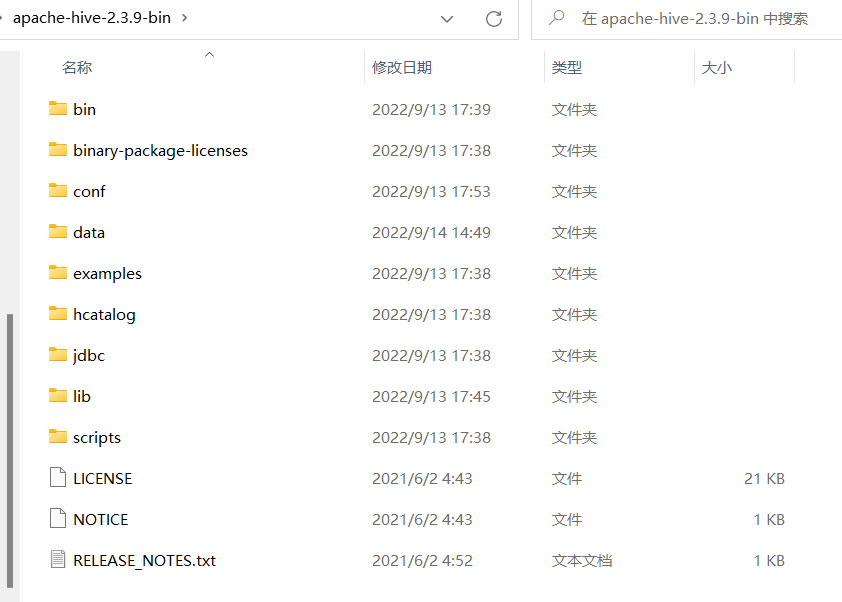
###### Hive配置文件说明
hive-env.xml
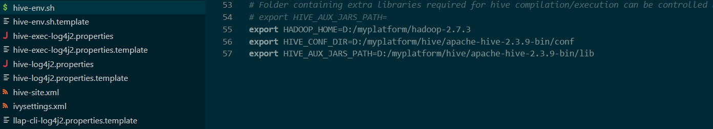
hive-site.xml
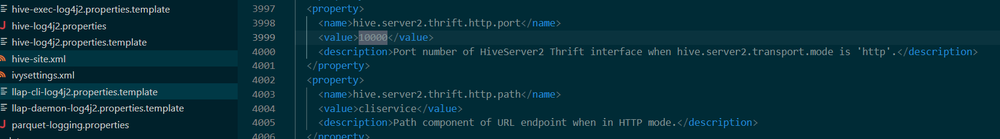

###### Hive运行效果
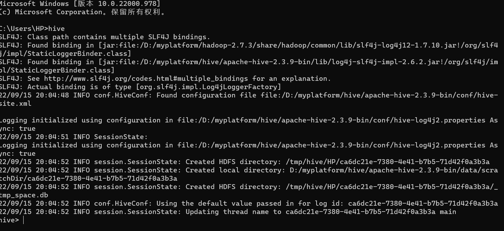
###### Pyhive 运行效果
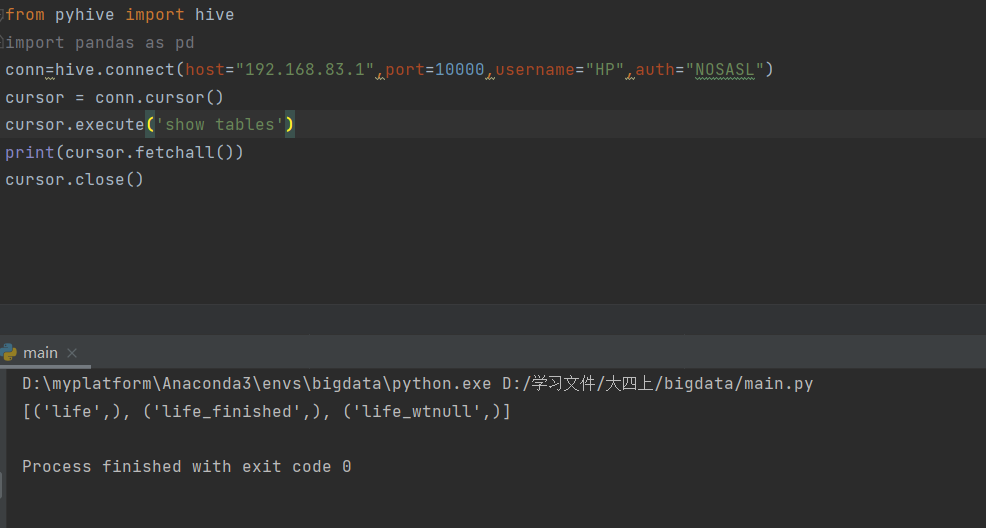
##### (4)Spark配置
###### Spark文件夹
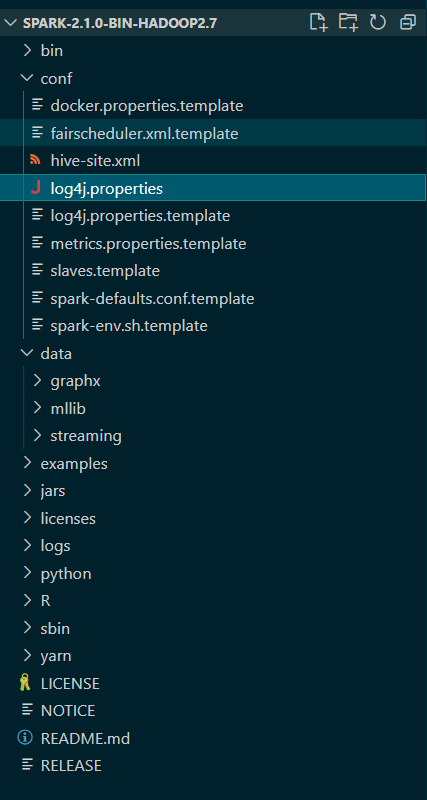
###### Spark运行效果
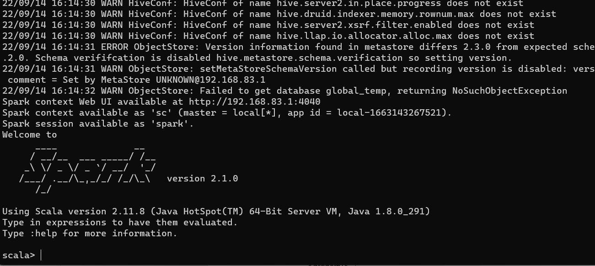
###### intellij+scala 效果
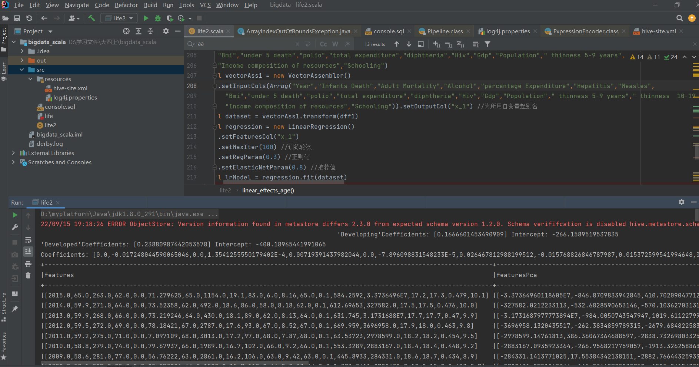


### 二：数据预处理

数据预处理代码

~~~scala
数据预处理代码
val status: DataFrame =sql("select country,status,year,life_expectancy,Adult_Mortality,infant_deaths,Alcohol,percentage_expenditure,HepatitisB,Measles,BMI,under_five_death,Polio,Total_expenditure,Diphtheria,HIV_AIDS,GDP,Population,thinness_under_19,thinness_over_19,Income_composition_of_resources,Schooling from life")
  val value: RDD[String] = status.rdd.map(linx => {
    linx.mkString(",")
  })
  case class info_type(
                        label1          : String,
                        label2          : String,
                        label3          : Double,
                        label4          : Double,
                        label5          : Double,
                        label6          : Double,
                        label7          : Double,
                        label8          : Double,
                        label9          : Double,
                        label10         : Double,
                        label11         : Double,
                        label12         : Double,
                        label13         : Double,
                        label14         : Double,
                        label15         : Double,
                        label16         : Double,
                        label17         : Double,
                        label18         : Double,
                        label19         : Double,
                        label20         : Double,
                        label21         : Double,
                        label22         : Double,
                        label23         : Double
              )
  val data=value.map(
  row => {
      var flag=0
      val strings:Array[String]=row.split(",")
      for(i<-0 to 21)
      {
        if(strings(i)=="null")
          {
            flag+=1
            strings(i)="-1"
          }
      }
     info_type(strings(0),strings(1),strings(2).toDouble,strings(3).toDouble,strings(4).toDouble,strings(5).toDouble,strings(6).toDouble,strings(7).toDouble,strings(8).toDouble,strings(9).toDouble,strings(10).toDouble,strings(11).toDouble,strings(12).toDouble,strings(13).toDouble,strings(14).toDouble,strings(15).toDouble,strings(16).toDouble,strings(17).toDouble,strings(18).toDouble,strings(19).toDouble,strings(20).toDouble,strings(21).toDouble,flag)
    })

```
~~~


##### （1）数据初步分析：

经过对数据的初步分析，可见该数据质量较差，有较多的空缺值，且有不符合标准的数据（例如“每千人婴儿死亡数”中有超过1000的数据），以及有一些离群点数据。因此需要对数据进行清洗，以获得较好的数据分析结果。


离群点分布

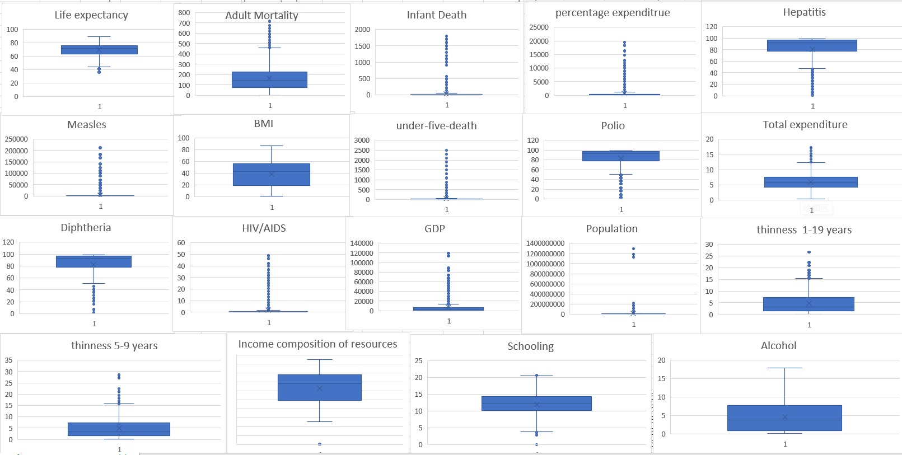

##### （2）空缺值处理：

因为该数据中空缺值较多，直接删除所有的数据会损失较大比例的数据，影响数据分析的精度，因此不可以直接删除有空缺值的行。

因此我们的处理方法是：

​	①空缺值的个数符合一定阈值，才删除该行。少数数据空缺值较多，不具备参考价值，我们可以直接对其进行删除处理。而那些只有少数空缺值的数据，我们可以根据其国家特征进行平均值的填充。这里我们删除空缺值的阈值为3，也就是说当一行数据的空缺值大于等于3时，我们将它删除。

```scala
dataframe=dataframe.filter("null_index<3")
```

​	②空缺值填充。对于一个空缺数据，我们的基本思想是创建一个国家对应的所有数据的平均值表，利用对应国家该列数据的平均值来填充。但是我们注意到有的国家的该列所有数据均空缺（如Bahamas的GDP列），为应对此种情况，我们还创建了一个以国家发展状态（status）对应的所有数据平均值表，若国家对应的该项平均值空缺，则以国家发展状态的平均值来填充。


获取发展中国家或者发达国家的均值

```scala
var develop_dataFrame=sql("select country,status,year,life_expectancy,Adult_Mortality,infant_deaths,Alcohol,percentage_expenditure,HepatitisB,Measles,BMI,under_five_death,Polio,Total_expenditure,Diphtheria,HIV_AIDS,GDP,Population,thinness_under_19,thinness_over_19,Income_composition_of_resources,Schooling from life_wtnull")
  var develop_dataFrame_avg=develop_dataFrame.groupBy("status").mean()
  var develop_dataFrame_avg_list=develop_dataFrame_avg.collectAsList()
```

获取国家的均值

```scala
var country_dataFrame_avg=develop_dataFrame.groupBy("country").mean()
var country_dataFrame_avg_list=country_dataFrame_avg.collectAsList()
```
数据空缺值填充代码，用均值进行填充, 并将数据存储到 life_finished中

```scala
var develop_dataFrame=sql("select country,status,year,life_expectancy,Adult_Mortality,infant_deaths,Alcohol,percentage_expenditure,HepatitisB,Measles,BMI,under_five_death,Polio,Total_expenditure,Diphtheria,HIV_AIDS,GDP,Population,thinness_under_19,thinness_over_19,Income_composition_of_resources,Schooling from life_wtnull")

   val value2= develop_dataFrame.rdd.map(linx => {

    var strings=linx.mkString(",").split(",")

   val country:String=strings(0)

    val status:String=strings(1)

   val a1=search_avg_status(status)

   val a2=search_avg_country(country)
    val aaaa=develop_dataFrame_avg_list.get(a1)

    val aaaa2=country_dataFrame_avg_list.get(a2)

   var flag=0

//     println(strings.size)

    for(i<-2 to 21)

    {

     if(strings(i)=="-1")

       {

        flag+=1
        println(aaaa.get(i))
        if(aaaa.get(i)==null)
         strings(i)=aaaa2.get(i-1).toString()
        else
         strings(i)=aaaa.get(i-1).toString()
       }
     }

   println(flag)

    println(country)

    info_type(strings(0),strings(1),strings(2).toDouble,strings(3).toDouble,strings(4).toDouble,strings(5).toDouble,strings(6).toDouble,strings(7).toDouble,strings(8).toDouble,strings(9).toDouble,strings(10).toDouble,strings(11).toDouble,strings(12).toDouble,strings(13).toDouble,strings(14).toDouble,strings(15).toDouble,strings(16).toDouble,strings(17).toDouble,strings(18).toDouble,strings(19).toDouble,strings(20).toDouble,strings(21).toDouble,0)

   })

   var value3= spark.createDataFrame(value2).toDF("Country","status","Year","Life_expectancy","Infants_Death","Adult Mortality","Alcohol","percentage Expenditure","Hepatitis","Measles",

    "Bmi","under_5_death","polio","total expenditure","diphtheria","Hiv","Gdp","Population"," thinness 5-9 years"," thinness  10-19 years",

    "Income composition of resources","Schooling","null_index")

   value3.write

     .mode("overwrite")

     .format("Hive")

     .insertInto("life_finished")
```

\```

##### （3）离群点处理：

​	①对于“每千人xxx”中不合理的数据（大于1000），我们直接删除
```scala
 dataframe=dataframe.filter("infants_death<1000 and measles<1000 and under_5_death<1000")
```

​	②消除离群点，我们的方法是消除每列前2.5%的数据和后2.5%的数据，以得到稳定的数据序列


数据预处理结果

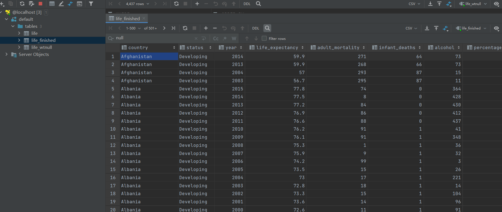


### 三：数据处理

#### (1)影响寿命的因素，对于生命数据进行线性回归

```scala
 def linear_effects_age(): Unit =

 {

  val lifeinfo=sql( "select year,life_expectancy,Adult_Mortality,infant_deaths,Alcohol,percentage_expenditure,HepatitisB,Measles,BMI,under_five_death,Polio,Total_expenditure,Diphtheria,HIV_AIDS,GDP,Population,thinness_under_19,thinness_over_19,Income_composition_of_resources,Schooling from life_finished")

  val life_rdd=lifeinfo.rdd

  val a=life_rdd.collect()

  val value = life_rdd.map(linx => {

   linx.mkString(",")

  })

  val c=value.collect()

  val value2 = life_rdd.map(linx => {

   linx.mkString(",")

  })

  val itemR2 = value2.map(lins => {

   val strings:Array[String] = lins.split(",")

   for(i<-1 to 19)

   {

     if(strings(i)=="null")

      strings(i)="0"

    }

   (strings(0).toDouble,strings(1).toDouble,strings(2).toDouble,strings(3).toDouble,strings(4).toDouble,strings(5).toDouble,strings(6).toDouble,strings(7).toDouble,strings(8).toDouble,strings(9).toDouble,strings(10).toDouble,strings(11).toDouble,strings(12).toDouble,strings(13).toDouble,strings(14).toDouble,strings(15).toDouble,strings(16).toDouble,strings(17).toDouble,strings(18).toDouble,strings(19).toDouble)

  })

  itemR2.collect()

  val dff1 = spark.createDataFrame(itemR2).toDF("Year","label","Infants Death","Adult Mortality","Alcohol","percentage Expenditure","Hepatitis","Measles",

   "Bmi","under 5 death","polio","total expenditure","diphtheria","Hiv","Gdp","Population"," thinness 5-9 years"," thinness  10-19 years",

   "Income composition of resources","Schooling")

  val vectorAss1 = new VectorAssembler()

   .setInputCols(Array("Year","Infants Death","Adult Mortality","Alcohol","percentage Expenditure","Hepatitis","Measles",

    "Bmi","under 5 death","polio","total expenditure","diphtheria","Hiv","Gdp","Population"," thinness 5-9 years"," thinness  10-19 years",

    "Income composition of resources","Schooling")).setOutputCol("x_1") //为所用自变量起别名

  val dataset = vectorAss1.transform(dff1)

  val regression = new LinearRegression()

   .setFeaturesCol("x_1")

   .setMaxIter(100) //训练轮次

   .setRegParam(0.3) //正则化

   .setElasticNetParam(0.8) //推荐值

  val lrModel = regression.fit(dataset)

  println(s"Coefficients: ${lrModel.coefficients} Intercept: ${lrModel.intercept}")

 }


```


##### 参数运行结果展示

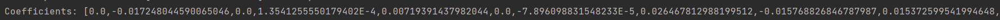


#### (2)人均寿命随时间变化（分发达国家和发展中国家）

```scala
def linear_year_lifeexpectacy(staus:String){

  val lifeinfo=sql( "select year, life_expectancy from life_finished where status="+staus)

  val life_rdd=lifeinfo.rdd

  val a=life_rdd.collect()

  val value = life_rdd.map(linx => {

  linx.mkString(",")

 })

  val c=value.collect()

  val value2 = life_rdd.map(linx => {

  linx.mkString(",")

 })

  val itemR2 = value2.map(lins => {

  val strings = lins.split(",")

  if (strings(1)=="null" ){

  strings(1) = "0"

  (strings(0).toInt, strings(1).toDouble)

 }

  (strings(0).toInt, strings(1).toDouble)


 })

 val aa=itemR2.collect()

  val dff1 = spark.createDataFrame(itemR2).toDF("x", "label")

  val vectorAss1 = new VectorAssembler()

  .setInputCols(Array("x")) //指定自变量名

  .setOutputCol("x_1") //为所以自变量起别名

  val frame1 = vectorAss1.transform(dff1)

  val regression = new LinearRegression()

  .setFeaturesCol("x_1")

  .setMaxIter(10) //训练轮次

  .setRegParam(0.3) //正则化

  .setElasticNetParam(0.8) //推荐值

  val lrModel = regression.fit(frame1)

  println(staus+s"Coefficients: ${lrModel.coefficients} Intercept: ${lrModel.intercept}")

 }
```

\```

##### 代码运行结果

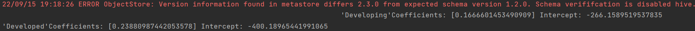


#### (3)影响寿命因素的主成分因子分析

```scala
 def PCA_status(dataframe:DataFrame): Unit ={

  val assembler = new VectorAssembler().setInputCols(Array("Year","Life_expectancy","Infants_Death","Adult Mortality","Alcohol","percentage Expenditure","Hepatitis","Measles",

   "Bmi","under_5_death","polio","total expenditure","diphtheria","Hiv","Gdp","Population"," thinness 5-9 years"," thinness  10-19 years",

   "Income composition of resources","Schooling")).setOutputCol("features")

  val pca = new PCA().setInputCol("features").setOutputCol("featuresPca").setK(5)

  val assembler_data = assembler.transform(dataframe)

  val pca_model = pca.fit(assembler_data)

  val pca_data = pca_model.transform(assembler_data)

  pca_data.select("features","featuresPca").show(false)

 }
```


##### 代码运行结果

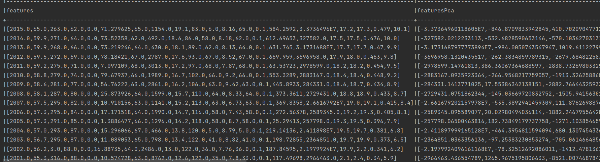


#### (4)影响发达国家的因素决策树模型

```scala
def classifier_develop(): Unit =

 {

  val vectorAss1 = new VectorAssembler()

 .setInputCols(Array("Year","Infants_Death","Adult Mortality","Alcohol","percentage Expenditure","Hepatitis","Measles",

  "Bmi","under_5_death","polio","total expenditure","diphtheria","Hiv","Gdp","Population"," thinness 5-9 years"," thinness  10-19 years",

  "Income composition of resources","Schooling")).setOutputCol("x_1")

  val dataset = vectorAss1.transform(dataframe)


  val lableIndexer=new StringIndexer().setInputCol("status").setOutputCol("indexedLabel").fit(dataset)

  val featureIndexer= new VectorIndexer().setInputCol("x_1").setOutputCol("indexedFeatures").setMaxCategories(4).fit(dataset)

  val labelConverter= new IndexToString().setInputCol("prediction").setOutputCol("predictedLabel").setLabels(lableIndexer.labels)

  // 训练数据和测试数据

  val Array(trainData,testData)=dataset.randomSplit(Array(0.7,0.3))

  val decisionTreeClassifier=new DecisionTreeClassifier().setLabelCol("indexedLabel").setFeaturesCol("indexedFeatures")

  //构建机器学习工作流

  val dt_pipeline=new Pipeline().setStages(Array(lableIndexer,featureIndexer,decisionTreeClassifier,labelConverter))

  val dt_model=dt_pipeline.fit(trainData)


  val dtprediction=dt_model.transform(testData)

  dtprediction.show(150)


  val evaluatorClassifier=new MulticlassClassificationEvaluator().setLabelCol("indexedLabel").setPredictionCol("prediction").setMetricName("accuracy")

  val accuracy=evaluatorClassifier.evaluate(dtprediction)

  println("准确率为: "+accuracy)

  val error=1-accuracy

  println("错误率为: "+error)

  val treeModelClassifier=dt_model.stages(2).asInstanceOf[DecisionTreeClassificationModel]

  val schema_DecisionTree=treeModelClassifier.toDebugString

  println("决策树的模型结构为: "+schema_DecisionTree)

 }
```


##### 代码运行结果

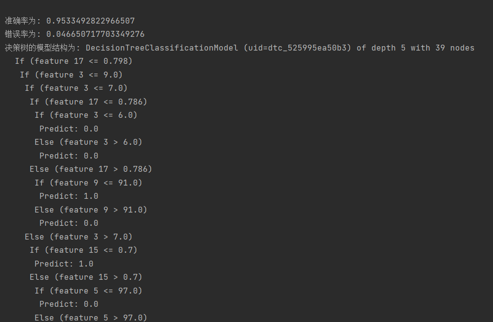


### 四：数据可视化

#### 预期寿命随时间变化


​	可见随时间推移，寿命期望整体上是增加的，虽然发达国家和发展中国家寿命绝对值不同，但整体上增速几乎相同，且有持续上涨的趋势。

#### 影响预期寿命的因素（线性回归）

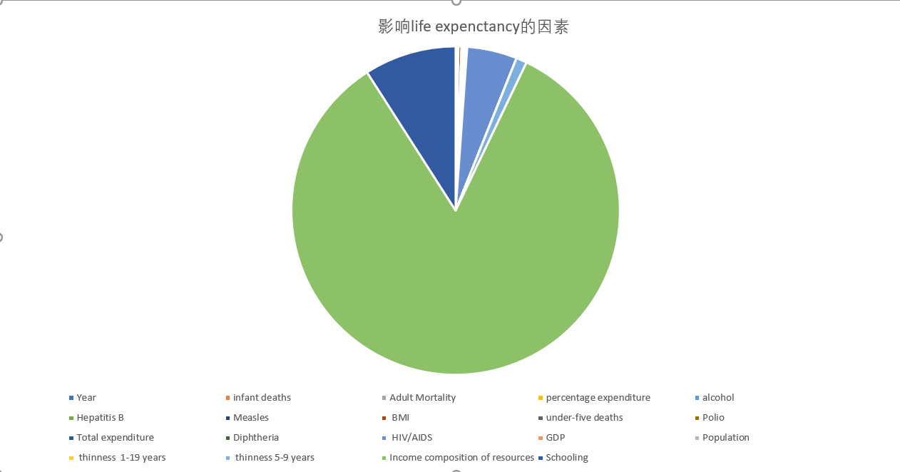

分析结果显示，影响寿命的因素最主要的是Income composition of resources，即按资源收入构成计算的人类发展指数，其次是HIV/AIDS和alcohol也会产生一定的影响。

#### 影响寿命因素的主成分因子分析

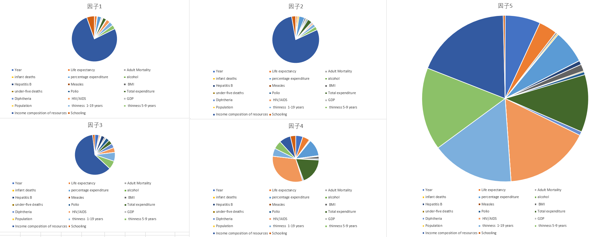

根据分析结果，前三个主成分因子的组成主要是Income composition of resources，其他因子有所变化。

因子4中，HIV/AIDS和Total expenditure为主要组成部分。

因子5中，Income composition of resources，HIV/AIDS，Total expenditure， thinness   1-19 years， thinness 5-9 years为主要组成部分

#### 影响发达国家的因素（决策树模型）


### 其他部分说明

#### 数据读入分区


#### Pyhive读取处理后的数据


### 小组成员任务分工与工作内容：

高野淇：搭建环境，配置部署hive数据库。配置部署好mysql,hive,hadoop,spark环境。将spark连接到hive数据库，并使用scala作为接口语言进行数据处理。

刘志一：数据预处理，制定分析方案。进行数据的预处理以及制定分析的方案，选择了①寿命随时间变化②影响寿命的因素③影响寿命因素主成分分析④影响发达国家因素 这四个数据处理方案。

王子涵：数据分析，可视化。可视化人均寿命随时间变化、线性回归处理影响寿命的因素、影响寿命因素主成分分析、使用决策树模型分析影响发达国家因素，并进行数据可视化处理。

### 实验总结

这次大数据实验让我们充分体验了大数据分析从搭建环境、数据集选择、数据预处理、数据分析、结可视化展示的整个流程。在整个过程中，我们遇到了不少问题，但通过搜索资料和查看助教文档的方式一一解决了它们。整体上来说我们对大数据的处理过程和方法有了更深入的了解，掌握了数据预处理和数据分析的基本方法，具有了一定的结果分析能力，提升了我们的大数据处理的水平。

### 数据分析过程中出现的问题与解决方案：

windows上搭建环境会遇到一些系统的问题，通过查阅资料解决。

未接触过spark和scala相关内容，根据网上的资料现学现用，不断调整方法。

数据处理的方法不太熟练，结合之前的数据挖掘课程，以及网上查找资料的方法设计了数据分析方案。
