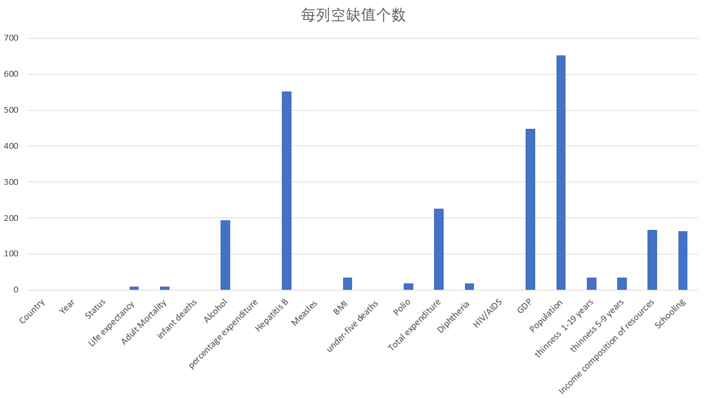
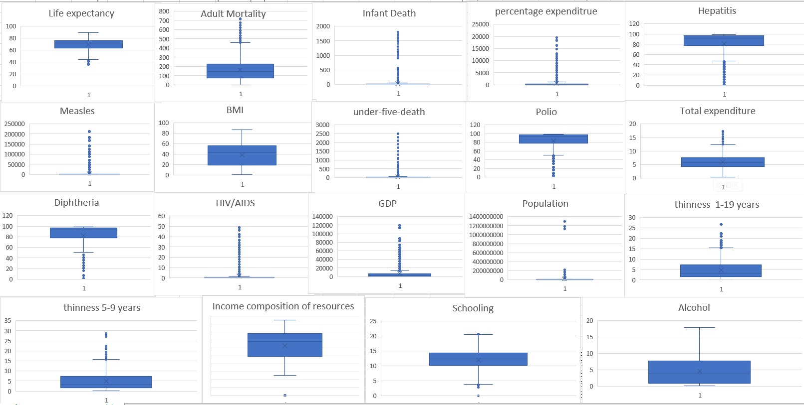

## 大数据实验小组报告

#### 分工表

高野淇：搭建环境，配置部署数据库

刘志一：数据预处理，制定分析方案

王子涵：数据分析，可视化

### 一： 环境部署

##### (1)Hadoop配置

##### (2)Mysql配置

##### (3)Hive配置

##### (4)Spark配置

##### (5)Scala配置

### 二：数据预处理

##### （1）数据初步分析：

经过对数据的初步分析，可见该数据质量较差，有较多的空缺值，且有不符合标准的数据（例如“每千人婴儿死亡数”中有超过1000的数据），以及有一些离群点数据。因此需要对数据进行清洗，以获得较好的数据分析结果。

#### 离群点统计

##### （2）空缺值处理：

因为该数据中空缺值较多，直接删除所有的数据会损失较大比例的数据，影响数据分析的精度，因此不可以直接删除有空缺值的行。

因此我们的处理方法是：

​	①空缺值的个数符合一定阈值，才删除该行。少数数据空缺值较多，不具备参考价值，我们可以直接对其进行删除处理。而那些只有少数空缺值的数据，我们可以根据其国家特征进行平均值的填充。这里我们删除空缺值的阈值为3，也就是说当一行数据的空缺值大于等于3时，我们将它删除。

​	②空缺值填充。对于一个空缺数据，我们的基本思想是创建一个国家对应的所有数据的平均值表，利用对应国家该列数据的平均值来填充。但是我们注意到有的国家的该列所有数据均空缺（如Bahamas的GDP列），为应对此种情况，我们还创建了一个以国家发展状态（status）对应的所有数据平均值表，若国家对应的该项平均值空缺，则以国家发展状态的平均值来填充。

##### （3）离群点处理：

​	①对于“每千人xxx”中不合理的数据（大于1000），我们直接删除

​	②消除离群点，我们的方法是消除每列前2.5%的数据和后2.5%的数据，以得到稳定的数据序列

### 三：数据处理

### 四：数据可视化

